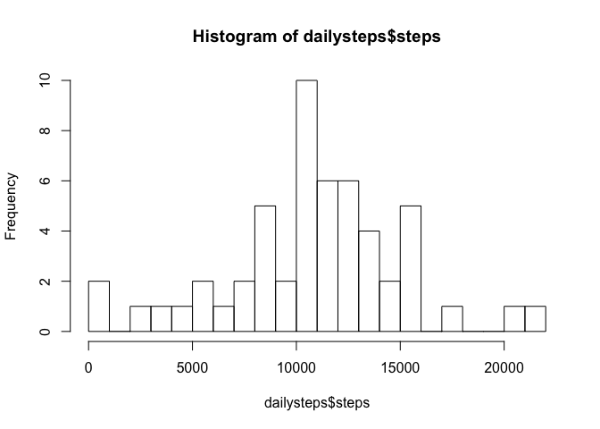
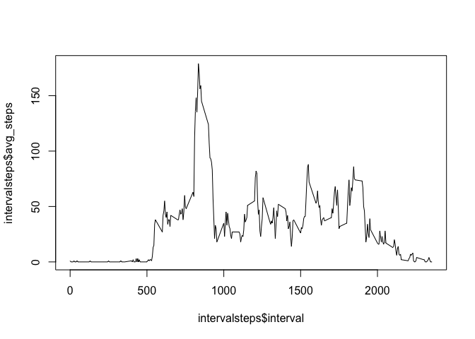
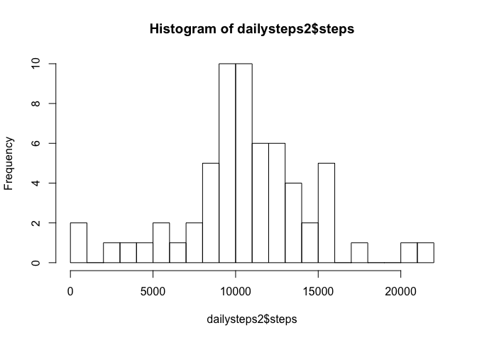
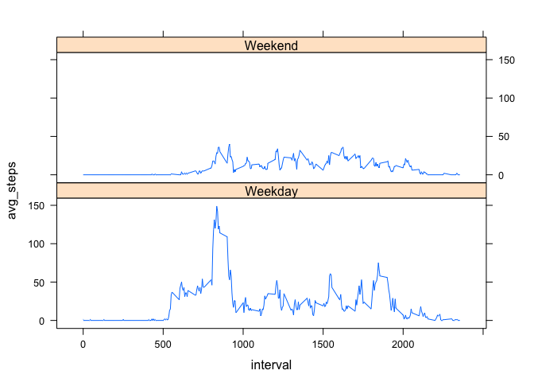

# Reproducible Research: Peer Assessment 1


## Loading and preprocessing the data

First let's unzip and load the data. To make the dates and times more
manageable, we add two new columns that have `Date` objects in them, based on
the `date` and `interval` values from the CSV.


```r
unzip("activity.zip")
data <- read.csv("activity.csv")
data$dateob <- as.POSIXct(strptime(data$date, format="%Y-%m-%d"))
data$datetime <- data$dateob + 60*data$interval
```

I'll be using the `sqldf` package for summarising the data, so let's bring that in as well. I'll also use `lattice` for plotting.


```r
options(gsubfn.engine = "R")
library(sqldf)
```

```
## Loading required package: gsubfn
## Loading required package: proto
## Loading required package: RSQLite
## Loading required package: DBI
```

```r
library(lattice)
```


## What is mean total number of steps taken per day?


```r
dailysteps <- sqldf("SELECT date, SUM(steps) AS steps FROM data GROUP BY date")
dailysteps
```

```
##          date steps
## 1  2012-10-01    NA
## 2  2012-10-02   126
## 3  2012-10-03 11352
## 4  2012-10-04 12116
## 5  2012-10-05 13294
## 6  2012-10-06 15420
## 7  2012-10-07 11015
## 8  2012-10-08    NA
## 9  2012-10-09 12811
## 10 2012-10-10  9900
## 11 2012-10-11 10304
## 12 2012-10-12 17382
## 13 2012-10-13 12426
## 14 2012-10-14 15098
## 15 2012-10-15 10139
## 16 2012-10-16 15084
## 17 2012-10-17 13452
## 18 2012-10-18 10056
## 19 2012-10-19 11829
## 20 2012-10-20 10395
## 21 2012-10-21  8821
## 22 2012-10-22 13460
## 23 2012-10-23  8918
## 24 2012-10-24  8355
## 25 2012-10-25  2492
## 26 2012-10-26  6778
## 27 2012-10-27 10119
## 28 2012-10-28 11458
## 29 2012-10-29  5018
## 30 2012-10-30  9819
## 31 2012-10-31 15414
## 32 2012-11-01    NA
## 33 2012-11-02 10600
## 34 2012-11-03 10571
## 35 2012-11-04    NA
## 36 2012-11-05 10439
## 37 2012-11-06  8334
## 38 2012-11-07 12883
## 39 2012-11-08  3219
## 40 2012-11-09    NA
## 41 2012-11-10    NA
## 42 2012-11-11 12608
## 43 2012-11-12 10765
## 44 2012-11-13  7336
## 45 2012-11-14    NA
## 46 2012-11-15    41
## 47 2012-11-16  5441
## 48 2012-11-17 14339
## 49 2012-11-18 15110
## 50 2012-11-19  8841
## 51 2012-11-20  4472
## 52 2012-11-21 12787
## 53 2012-11-22 20427
## 54 2012-11-23 21194
## 55 2012-11-24 14478
## 56 2012-11-25 11834
## 57 2012-11-26 11162
## 58 2012-11-27 13646
## 59 2012-11-28 10183
## 60 2012-11-29  7047
## 61 2012-11-30    NA
```

```r
hist(dailysteps$steps, breaks=20)
```

 

```r
mean(dailysteps$steps, na.rm=TRUE)
```

```
## [1] 10766.19
```

```r
median(dailysteps$steps, na.rm=TRUE)
```

```
## [1] 10765
```


## What is the average daily activity pattern?


```r
sqldf("SELECT COUNT(DISTINCT date) FROM data")
```

```
##   COUNT(DISTINCT date)
## 1                   61
```

```r
intervalsteps <- sqldf("SELECT interval, SUM(steps)/61 AS avg_steps FROM data GROUP BY interval")
plot(intervalsteps$interval, intervalsteps$avg_steps, type="l")
```

 

```r
intervalsteps[which.max(intervalsteps$avg_steps),]
```

```
##     interval avg_steps
## 104      835       179
```


## Imputing missing values


```r
length(which(is.na(data$steps)))
```

```
## [1] 2304
```

```r
incomplete <- data[!complete.cases(data),]
sqldf("SELECT date, COUNT(interval) FROM incomplete GROUP BY date")
```

```
##         date COUNT(interval)
## 1 2012-10-01             288
## 2 2012-10-08             288
## 3 2012-11-01             288
## 4 2012-11-04             288
## 5 2012-11-09             288
## 6 2012-11-10             288
## 7 2012-11-14             288
## 8 2012-11-30             288
```

So we see that whole days are missing. I chose to simply replace each missing day's intervals with the average intervals, which were calculated above. (The averages are across non-missing data only.)


```r
data2 <- merge(data, intervalsteps, by="interval")
data2$steps = ifelse(is.na(data2$steps), data2$avg_steps, data2$steps)
dailysteps2 <- sqldf("SELECT date, SUM(steps) AS steps FROM data2 GROUP BY date")
dailysteps2
```

```
##          date steps
## 1  2012-10-01  9225
## 2  2012-10-02   126
## 3  2012-10-03 11352
## 4  2012-10-04 12116
## 5  2012-10-05 13294
## 6  2012-10-06 15420
## 7  2012-10-07 11015
## 8  2012-10-08  9225
## 9  2012-10-09 12811
## 10 2012-10-10  9900
## 11 2012-10-11 10304
## 12 2012-10-12 17382
## 13 2012-10-13 12426
## 14 2012-10-14 15098
## 15 2012-10-15 10139
## 16 2012-10-16 15084
## 17 2012-10-17 13452
## 18 2012-10-18 10056
## 19 2012-10-19 11829
## 20 2012-10-20 10395
## 21 2012-10-21  8821
## 22 2012-10-22 13460
## 23 2012-10-23  8918
## 24 2012-10-24  8355
## 25 2012-10-25  2492
## 26 2012-10-26  6778
## 27 2012-10-27 10119
## 28 2012-10-28 11458
## 29 2012-10-29  5018
## 30 2012-10-30  9819
## 31 2012-10-31 15414
## 32 2012-11-01  9225
## 33 2012-11-02 10600
## 34 2012-11-03 10571
## 35 2012-11-04  9225
## 36 2012-11-05 10439
## 37 2012-11-06  8334
## 38 2012-11-07 12883
## 39 2012-11-08  3219
## 40 2012-11-09  9225
## 41 2012-11-10  9225
## 42 2012-11-11 12608
## 43 2012-11-12 10765
## 44 2012-11-13  7336
## 45 2012-11-14  9225
## 46 2012-11-15    41
## 47 2012-11-16  5441
## 48 2012-11-17 14339
## 49 2012-11-18 15110
## 50 2012-11-19  8841
## 51 2012-11-20  4472
## 52 2012-11-21 12787
## 53 2012-11-22 20427
## 54 2012-11-23 21194
## 55 2012-11-24 14478
## 56 2012-11-25 11834
## 57 2012-11-26 11162
## 58 2012-11-27 13646
## 59 2012-11-28 10183
## 60 2012-11-29  7047
## 61 2012-11-30  9225
```

```r
hist(dailysteps2$steps, breaks=20)
```

 

```r
mean(dailysteps2$steps, na.rm=TRUE)
```

```
## [1] 10564.07
```

```r
median(dailysteps2$steps, na.rm=TRUE)
```

```
## [1] 10395
```

So we see that each missing day was replaced with the average, as desired. The operation caused the mean and median to both be slightly lower for the imputed data. This is because the average-interval day, which we used for the imputation, has somewhat fewer total steps than the average day.


## Are there differences in activity patterns between weekdays and weekends?

I used the original, NA-containing data for this rather than the imputed data. `xyplot` is from the `lattice` package.


```r
data$weekend <- weekdays(as.Date(data$date, format="%Y-%m-%d")) %in% c("Saturday", "Sunday")
data$weekend <- ifelse(data$weekend, "Weekend", "Weekday")
intervalsteps <- sqldf("SELECT interval, SUM(steps)/61 AS avg_steps, weekend FROM data GROUP BY interval, weekend")
xyplot(avg_steps ~ interval | weekend, data=intervalsteps, type="l", layout=c(1,2))
```

 
